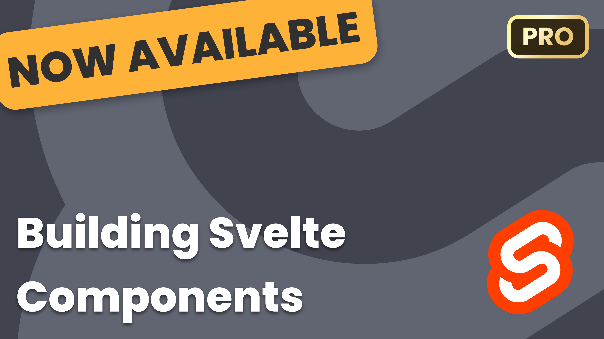

# Building Svelte Components

Try The Course
https://www.leveluptutorials.com/tutorials/building-svelte-components/

If you've ever built a site with React, you'll know that things can feel overly complex. All of the libraries and pitfalls that come with learning React can make you feel overwhelmed quickly. In comes Svelte.

Svelte is a radical new approach to building user interfaces. Whereas traditional frameworks like React and Vue do the bulk of their work in the browser, Svelte shifts that work into a compile step that happens when you build your app.

In this course, you'll learn common patterns for writing Svelte components and even how to publish a Svelte component library on NPM.

Building Svelte Components is the perfect way to find out how to write simple, powerful components in Svelte. Check out our new course for a beginner-friendly way to level up!

Course Instructor
Scott Tolinski: @stolinski

https://www.leveluptutorials.com
